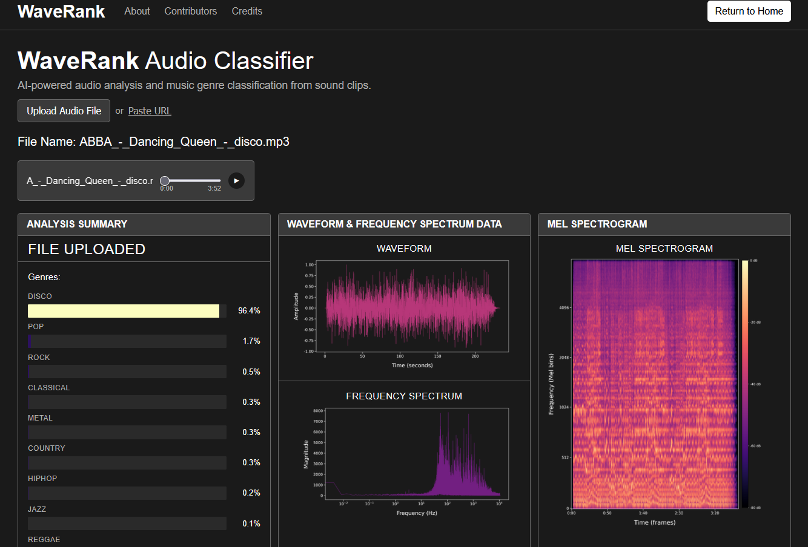
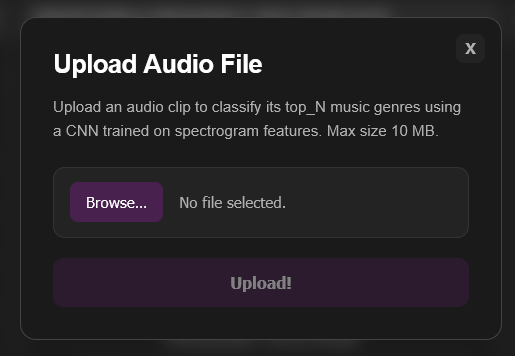
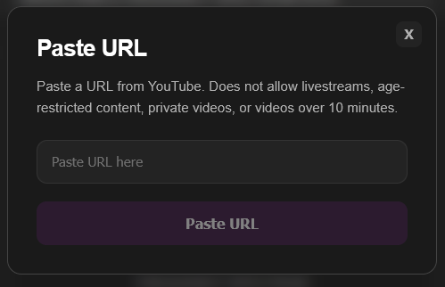
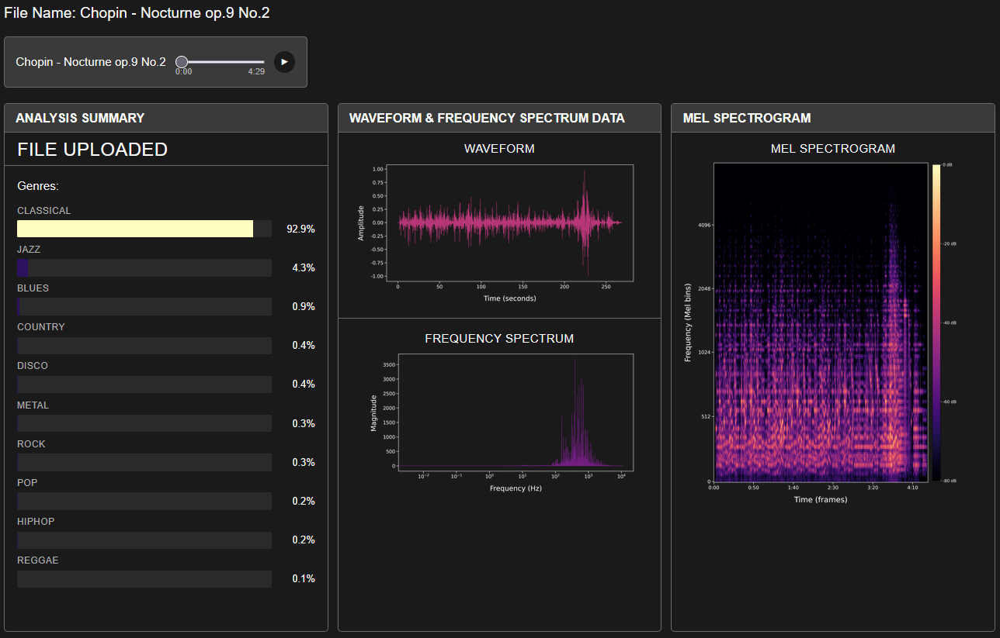

# WaveRank
WaveRank is a web app that classifies the top music genres of an audio file using a CNN trained on mel-scaled spectrogram features. Upload an audio file or paste a YouTube URL to get genre predictions along with waveform, frequency spectrum, and mel spectrogram visualizations.



## Using the Website
WaveRank is hosted at **[waverank.vercel.app](https://waverank.vercel.app)**.
No login required.

Alternatively, you can run the web app locally (see: [Local Development Setup](#local-development-setup))

> Note: The hosted demo may take up to 2 minutes to load after a period of 
inactivity due to serverless sleep mode.
 
1. Click **Upload Audio File** to upload a `.wav`, `.mp3`, or `.mp4` file (max 
10MB), or click **Paste URL** to enter a YouTube link.
    > Don't have an audio file handy? Download a sample from our [test audio files](https://drive.google.com/drive/folders/1BpH3PP8-jUCh-4cKUH3o7pxAgcRvHPmF?usp=sharing).
2. Wait for the audio to process, this may take a few seconds.
3. View your genre predictions and audio visualizations while you listen to 
your song on the built-in audio player.
    > Note: YouTube URL uploads do not support livestreams, age-restricted content,
private videos, or videos over 10 minutes. **YouTube URL uploads are 
unavailable in the hosted demo due to YouTube's bot detection blocking 
requests from cloud hosting providers - this feature only works when running
locally.**
 
**Upload Audio File:**



**Upload Via YouTube URL:**



**Example Results:**


 
---

## Local Development Setup
 
> **Note:** Local development is recommended on **Linux or macOS**. Windows is
not officially supported.
 
> **Note:** This repository uses [Git LFS](https://git-lfs.com/) to store the
trained model file. **Do not download as a ZIP!** The model will not be
included. You must clone the repository using Git:
> ```
> git clone https://github.com/WaveRank/waverank.git
> ```
> For help with cloning, see [GitHub's cloning instructions](https://docs.github.com/en/repositories/creating-and-managing-repositories/cloning-a-repository).
 
### Prerequisites
- Python 3.11+
- Node.js v20.20+
- Git LFS
- ffmpeg

#### Installing Python 3.11
On Ubuntu/Debian, Python 3.11 may not be the default. Install it and required tools with:
```
sudo apt install python3.11 python3.11-venv python3-pip
```
#### Installing Node.js
Download and install from [nodejs.org](https://nodejs.org/) or use your system's package manager.

#### Installing Git LFS
```
sudo apt install git-lfs
git lfs install
```

#### Installing ffmpeg
ffmpeg is required for YouTube audio downloads.

- **Linux (Ubuntu/Debian):**
  ```
  sudo apt update
  sudo apt install ffmpeg
  ```
 
- **Mac:**
  ```
  brew install ffmpeg
  ```

- **Verify installation:**
  ```
  ffmpeg -version
  ```
 
---
 
### Frontend
Navigate to the project root, then open a new terminal and run:
```
cd webapp/client
npm install
npm run dev
```
> Note: `npm install` only needs to be run once, or after pulling changes that update `package.json`.
 
### Backend
Navigate to the project root, then open a new terminal and run:
 
**Linux/Mac:**
```
python3.11 -m venv env
source env/bin/activate
pip install -r requirements.txt
python3 -m scripts.run_server
```
> Note: `pip install -r requirements.txt` only needs to be run once, or after
pulling changes that update `requirements.txt`.

> Note: If predictions are taking more than 5-10 seconds per file, your GPU
may not be in use. See the [TensorFlow GPU guide](https://www.tensorflow.org/install/pip#gpu)
for setup instructions specific to your system.


### Navigate to web app

Once both the frontend and backend are running, open your browser and navigate 
to [http://localhost:5173](http://localhost:5173)

---

## Server Testing
Automated testing of the server API. Three collections run in parallel to 
simulate simultaneous requests. Requires Newman (`npm install -g newman`).
 Run from the project root with the server already running.

**Parallel (faster):**
```
newman run tests/postman/WaveRank-1.postman_collection.json -e tests/postman/WaveRank-Local.postman_environment.json &
newman run tests/postman/WaveRank-2.postman_collection.json -e tests/postman/WaveRank-Local.postman_environment.json &
newman run tests/postman/WaveRank-3.postman_collection.json -e tests/postman/WaveRank-Local.postman_environment.json &
wait

```

**Single-threaded:**
```
newman run tests/postman/WaveRank-sequential.postman_collection.json -e tests/postman/WaveRank-Local.postman_environment.json
```

---

## Building the model from source data
> **Note:** A pre-trained model is already included in the repository. 
This section is only necessary if you want to retrain the model from scratch, 
which is *NOT* needed to run the web app!

### Prepare Raw Data
Sort source `.wav` audio files into directories named after each genre, and 
place them within `data/genres_original`.
You can get the GTZAN dataset we used from 
[Kaggle](https://www.kaggle.com/datasets/andradaolteanu/gtzan-dataset-music-genre-classification).
This dataset is already sorted into genres. Copy the 'genres_original' directory
into 'data/' so you have 'data/genres_original', with all the genre subdirectories
inside.

Alternatively, any sorted dataset will work — place genre subdirectories 
inside `data/genres_original`. This should work with any number or type of
genres. Combining multiple datasets is technically possible but you would
ideally want to control for duplicate songs, overlapping genres, etc.

### Preprocessing
Split the dataset into training, validation, and test directories, segment the 
original `.wav` files, and convert the segments to spectrograms. Wait for each 
command to finish before running the next.
```
python3 -m model.src.preprocessing.1_distribute_dataset
python3 -m model.src.preprocessing.2_segment_dataset
python3 -m model.src.preprocessing.3_wav_to_spectrogram
```
### Training
Training the model can take a very long time! Utilizing a GPU, e.g. via 
`tensorflow-with-cuda`, can greatly speed up this process. You will need to 
install the appropriate package and export it to python's env path to enable it.
With an Nvidia GPU, it might be something like:
```
export LD_LIBRARY_PATH=$(find $VIRTUAL_ENV/lib/python3.11/site-packages/nvidia -type d -name lib | tr "\n" ":"):$LD_LIBRARY_PATH
```
> For GPU setup instructions specific to your system, see the 
[TensorFlow GPU guide](https://www.tensorflow.org/install/pip#gpu).

You can verify your GPU is working with: 
```
python3 -c "import tensorflow as tf; print(tf.config.list_physical_devices('GPU'))"
```
If you see a GPU listed at the end, you know it is working, e.g.:
```
[PhysicalDevice(name='/physical_device:GPU:0', device_type='GPU')]
```

> **Note:** Do not run other intensive tasks while training - this may cause 
TensorFlow to become unstable.

Use these commands to build the trained model from the spectrogram images. The
model will be saved as `model/artifacts/final_model.keras`.
```
python3 -m model.src.model_training.main
```

### Hyperparameter Tuning (Optional)
Hyperparameter tuning uses Optuna's Bayesian optimization (TPE sampler) to
search for the best combination of learning rates, dropout rate, and model
depth across N trials. Run this *before* `main.py` to find optimal
hyperparameters, then update `model/config.py` with the best results before
running the full training pipeline. The current saved version of the model has
done this already!
```
python3 -m model.src.model_training.tune
```
> Note: Performing some other tasks with your pc while this is running may cause
Tensorflow to become unstable. Training time can also be decreased by lowering 
`TRAINING_EPOCHS` and `FINE_TUNE_EPOCHS` in `model/config.py`.

### Inference Testing
Place test songs in `data/test_songs` and run:
```
python3 -m tests.test_inference
```
Output will be saved to `tests/artifacts/inference_test_results.json`.
Alternatively, the web app uses the same inference pipeline.

---
 
## Contributors
 
| Name | GitHub | Role |
|------|--------|------|
| Emily Huntley | [emilyfhuntley](https://github.com/emilyfhuntley) | YouTube Integration Engineer & Assistant ML Trainer |
| Kevin Klein | [KevKlein](https://github.com/KevKlein)  | Backend Engineer |
| Madeline Rachow | [MadelineRachow](https://github.com/MadelineRachow)  | Frontend Engineer |
| Angela Shin | [angshin](https://github.com/angshin)  | Head ML Engineer |
 
---
 
## Known Issues
- Only trained on 10 genres that don't fully reflect modern listening habits
- Small dataset results in higher overfitting and lower accuracy than desired
- YouTube integration is unavailable in the hosted demo due to YouTube's bot 
detection blocking cloud server IP addresses, works fully in local development

---

## Future Development
- Expand training dataset: more songs and more genres
- Resolve YouTube integration for hosted deployment: potential approaches
include residential proxy services or a dedicated non-cloud server
- Integrate additional music platforms (Spotify, Apple Music, etc.)
 
---


## Acknowledgements

WaveRank was built with the help of the following tools, libraries, and 
resources. See the website for even more details.

<table>
  <thead>
    <tr>
      <th>Category</th>
      <th>Resource</th>
    </tr>
  </thead>
  <tbody>
    <tr>
      <td>Dataset</td>
      <td><a href="https://www.kaggle.com/datasets/andradaolteanu/gtzan-dataset-music-genre-classification/data">GTZAN Genre Collection</a></td>
    </tr>
    <tr>
      <td rowspan="3">Deep Learning & AI</td>
      <td><a href="https://www.tensorflow.org/api_docs">TensorFlow & Keras</a></td>
    </tr>
    <tr>
      <td><a href="https://www.tensorflow.org/guide/keras/transfer_learning">ResNet50 & Transfer Learning</a></td>
    </tr>
    <tr>
      <td><a href="https://optuna.readthedocs.io/en/stable/reference/samplers/index.html">Optuna Sampler</a></td>
    </tr>
    <tr>
      <td rowspan="3">Audio Processing</td>
      <td><a href="https://librosa.org/doc/main/generated/librosa.feature.melspectrogram.html">Librosa</a></td>
    </tr>
    <tr>
      <td><a href="https://medium.com/analytics-vidhya/understanding-the-mel-spectrogram-fca2afa2ce53">Understanding Mel Spectrograms</a></td>
    </tr>
    <tr>
      <td><a href="https://github.com/yt-dlp/yt-dlp">yt-dlp</a></td>
    </tr>
    <tr>
      <td rowspan="2">Metrics & Visualization</td>
      <td><a href="https://scikit-learn.org/stable/modules/generated/sklearn.metrics.roc_curve.html">Scikit-Learn</a></td>
    </tr>
    <tr>
      <td><a href="https://matplotlib.org/stable/api/_as_gen/matplotlib.pyplot.legend.html">Matplotlib</a></td>
    </tr>
    <tr>
      <td rowspan="2">Frontend & Web</td>
      <td><a href="https://react.dev/">React</a></td>
    </tr>
    <tr>
      <td><a href="https://flask.palletsprojects.com/">Flask</a></td>
    </tr>
  </tbody>
</table>
